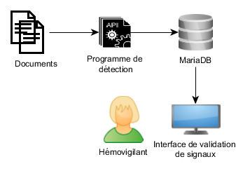

# TACO

L'acronyme anglais TACO (pour Transfusion-Associated Circulatory Overload) est utilisé pour désigner les œdèmes aigus pulmonaires (OAP) de surcharge. 
Les TACO sont des évènements indésirables fréquents et graves suite à une transfusion d'un produit sanguin labile, notamment les concentrés de globules rouges (CGR). 

D'après l'article R1221-49 du code de la santé publique, «tout professionnel de santé qui constate ou a connaissance d'un incident grave le signale sans délai au correspondant d'hémovigilance et de sécurité transfusionnelle de l'établissement». Le correspondant d'hémovigilance rappelle les mesures de prévention et remonte ces évènements à l'ANSM chargée de la mise en œuvre de l'hémovigilance au niveau national. 

Les systèmes de surveillance passive sont connus pour sous-estimer l'incidence des évènements indésirables liés aux soins. Les systèmes de détection automatique ont pour objectif de générer des alertes à partir des données. Ces systèmes visent une bonne sensibilité au détriment de la spécificté, ceci nécessite une validation manuelle des alertes remontées par ces systèmes. 

Ce dépôt contient le système de détection automatique des TACO mis en place au CHU de Bordeaux. Ce dernier utilise uniquement les données textuelles pour rechercher la présence de TACO. 

Ce tutoriel explique son installation pour permettre sa réutilisation par d'autres établissements. La mise en place de ce système est facilitée par la présence d'un entrepôt de données au sein de l'établissement. 

## Table des matières

<!-- toc -->

- [Installation locale](#installation-locale)
  * [Prérequis](#prerequis)
  * [Installation](#installation)
- [Fonctionnement](#fonctionnement)
- [API](#api)
- [Démo](#demo)
- [Licence](#licence)

<!-- tocstop -->

## Installation locale
L'installation avec Docker nécessite une distribution Linux et a été testée uniquement sous Ubuntu 18.04. Une connexion Internet est nécessaire pour l'installation.   
Il serait aussi possible d'installer l'application sans utiliser Docker.  

### Prérequis

L'application est composée de :  

- un programme Java de détection des TACO  
Il tourne dans un [tomcat](http://tomcat.apache.org/). Les documents textuels sont transmis à une API. Le programme génère des "signaux" ou alertes qui sont enregistrés dans une base de données.   

- une base de données [MariaDB](https://mariadb.org/)  
Elle stocke notamment les signaux du programme de détection et la validation de ces derniers par les utilisateurs. 

- une interface [NodeJs](https://nodejs.org/en/)  
Elle permet aux utilisateurs de valider ou invalider manuellement les signaux détectés par l'algorithme.

L'installation de l'application est facilitée par l'utilisation de conteneurs [Docker](https://docs.docker.com/install/). 


### Installation

1. Modification des variables d'environnement (optionnel)

```
nano .env
```

Les variables d'environnement sont situées dans le fichier '.env'.  
Ce fichier contient notamment le nom d'utilisateur et le mot de passe de la base de données. Il est conseillé de les modifier. 

2. Compilation du programme Java (optionnel)

La compilation du programme Java nécessite au minimum Java 1.8 et [Apache Maven](https://maven.apache.org/download.cgi).  Lancer la commande suivante dans le dossier 'api' : 
```
mvn clean package
```
Cette commande produit un fichier 'taco-0.0.1.war' dans le dossier target.  
Ce fichier est téléchargeable à cette adresse : 
```
mkdir ./api/target
wget -O ./api/target/taco-0.0.1.war http://91.121.106.228/TACO/taco-0.0.1.war
```

md5sum du fichier taco-0.0.1.war: c6991165d842ee9537ad1bc954ecf933


3. Lancement de l'application :

```
docker-compose up -d
```
docker-compose lance plusieurs conteneurs : une instance de MariaDB, un Tomcat et un serveur NodeJs. 


4. Création de la base de données

```
docker exec -i mariadbTaco /bin/bash -c "mariadb/loadMariaDBdata.sh"
```
Cette commande crée la base de données "TACO", son schéma et les droits utilisateurs. 

Si vous avez une erreur "ERROR 2002 (HY000): Can't connect to MySQL server on '127.0.0.1' (115)", il faut attendre quelques secondes avant de répéter la commande car l'initialisation de la base de données n'est pas terminée. 

5. Transférer le fichier taco-0.0.1.war dans le Tomcat

Lancer la commande suivante : 

```
docker cp ./api/target/taco-0.0.1.war tomcattaco:/usr/local/tomcat/webapps
```

Si vous n'avez pas modifié les variables d'environnement, vous pouvez accéder à l'interface sur le port 5002 (http://mon-serveur:5002). 
Les utilisateurs doivent s'enregistrer pour accéder à l'application. Les données d'authentification sont stockées dans MariaDB (table UserAuth). Les mots de passe sont hashés, [Passport.js](http://www.passportjs.org/) est utilisé.  


### Fonctionnement 
L'application ne transmet aucune donnée et ne fait appel à aucun service extérieur. Une connexion Internet est nécessaire à l'interface pour la récupération de fichiers CSS ([BootStrap](https://getbootstrap.com/)) et JavaScript ([JQuery](https://jquery.com/)). 



> Les données textuelles sont transmises à l'API par des informaticiens de l'établissement ayant accès aux données du système d'information hospitalier (SIH). Les alertes générées par le programme sont stockées dans la base de données : phrase mentionnant la présence de TACO et quelques métadonnées du document (voir plus bas). Les hémovigilants de l'établissement se connectent à l'interface pour valider ou non ces alertes. Si une alerte est validée et non signalée par les professionnels de santé, les hémovigilants retournent au dossier patient informatisé de l'établissement pour disposer de l'ensemble des informations puis contactent l'équipe de soins.  

### API
Un établissement souhaitant utilisé ce système de détection automatique des TACO doit mettre en place un flux pour transmettre les documents textuels vers l'API de détection. 
Au CHU de Bordeaux, les données textuelles sont extraites d'un entrepôt de données biomédicales basé sur la solution open-source [i2b2](https://www.i2b2.org/) puis transmises à l'API.  
 
Pour chaque document textuel, une requête HTTP POST doit être envoyée. Un exemple est donné dans le fichier 'testAPI.R' (./mariaDB/R). 

```
library(httr)
txt <- "OAP suite à transfusion de 3 CGR"
nsej <- 9
npat <- 5
date <- "2019-06-21"
loc <- "CRC"

httr::POST(url="http://localhost:8893/taco-0.0.1/DetectTACO",
           body = txt, 
           query=list(
             Nsej = nsej,
             Npat = npat,
             date = date,
             loc = loc
           ))
```

Après installation locale dans l'établissement, l'API est accessible à l'URL 'http://mon-serveur:8893/taco-0.0.1/DetectTACO' où 'mon-serveur' est le nom du serveur sur le réseau interne.  
Une requête HTTP POST est attendue.  
Le document textuel (contenu du formulaire DxCare, compte-rendu d'hospitalisation...) doit être envoyé dans le body de la requête HTTP.  
Les autres métadonnées, pour permettre un retour au dossier quand une alerte est détectée, doivent être envoyées en paramètres : 

- Nsej : numéro de séjour dans le SIH  
- Npat : numéro du patient dans le SIH  
- date : date au format "YYYY-mm-dd"  
- loc : une information sur la localisation du document pour faciliter le travail de vérification lors du retour au dossier patient informatisé  

## Démo
Vous pouvez tester l'interface à cette adresse : http://91.121.106.228:5002/  
email: demo@chu-bordeaux.fr  
pwd: demotacto

Des signaux existent à la date du 6/20/2019

## Licence
MIT